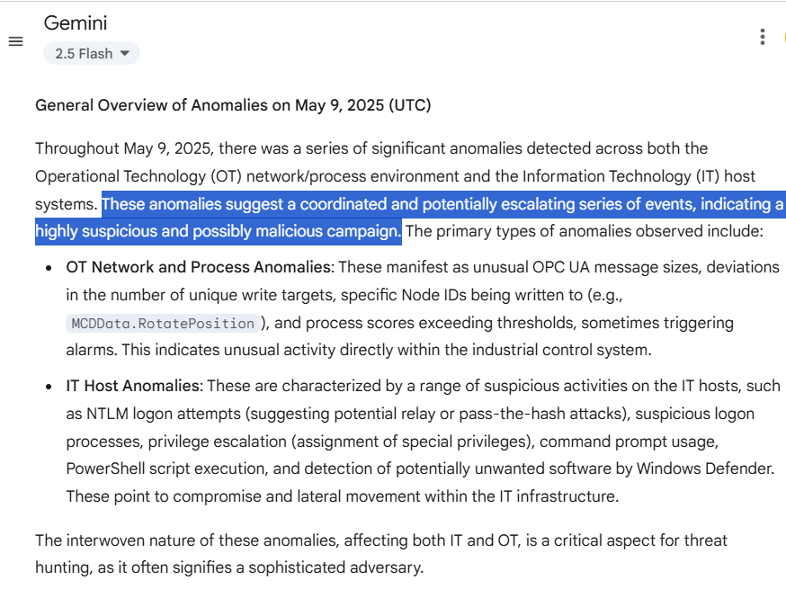
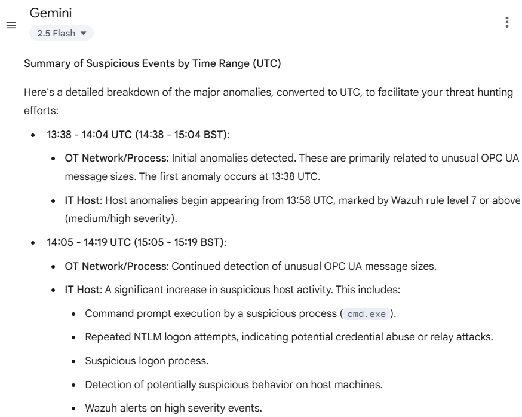
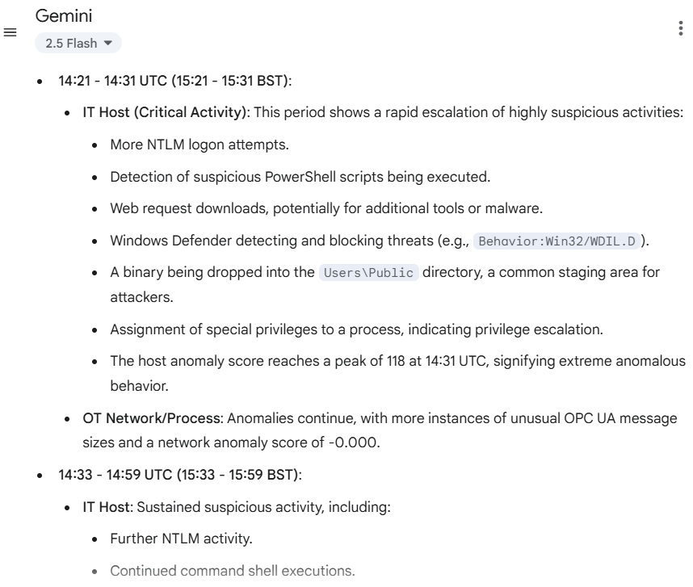
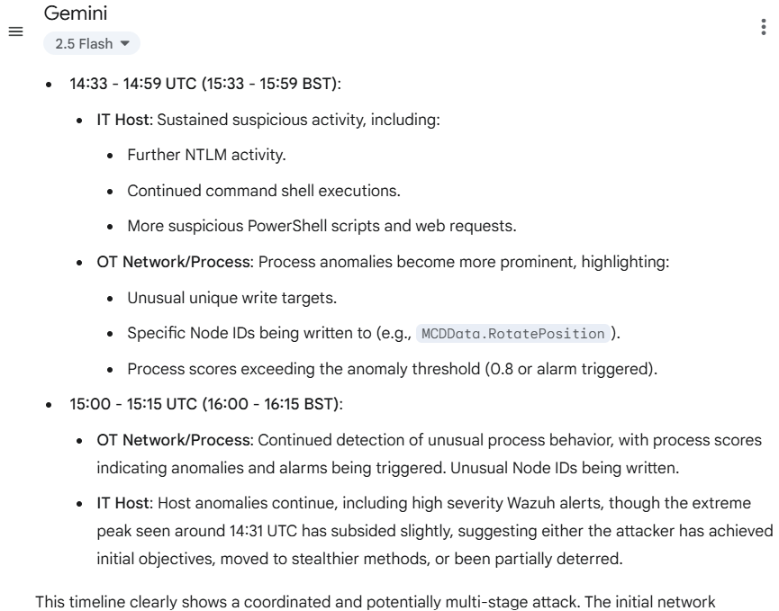
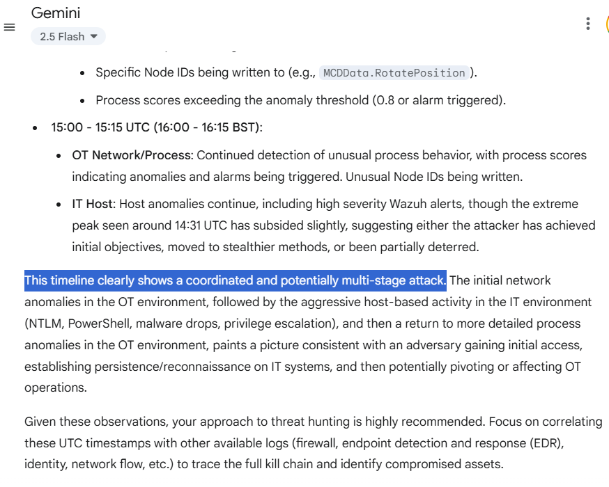

# LOTL-Hunter: Detecting Multi-Stage Living-off-the-Land (LOTL) Attacks in Cyber-Physical Systems using Decision Fusion Techniques with Digital Twins

## Overview
This repository contains dataset and code supporting our study on **two-level decision fusion** for detecting stealthy, multi-stage Living-off-the-Land (LOTL) attacks in Cyber-Physical Systems (CPS) and Industrial Control Systems (ICS).

### Key Highlights
- **Digital Twin Testbed**: Safe, repeatable simulation of multi-stage attacks using Siemens NX MCD + PLCSim Advanced with OPC UA and open-source security tools.
- **Two-Level Fusion Strategy**:
  - **First-level fusion (OT layer)** combines process anomalies (LSTM-FCN), OPC UA network anomalies (Isolation Forest), and process alarms.
  - **Second-level fusion (IT/OT correlation)** integrates OT results with host anomalies from Wazuh logs.
- **Improved Detection**: Early detection and improved performance against stealthy multi-stage APT behaviours.
- **LLM Support (Experimental)**: Natural-language summarisation of fused anomaly logs to aid interpretability.

## Dataset & Code
- **Process data**: Time-series actuator/sensor values exported from Siemens NX MCD.  
- **Network data**: OPC UA traffic captured with Wireshark and parsed with Zeek.  
- **Host logs**: Windows 11 Wazuh alerts and Sysmon logs under LOTL simulations.  
- **Code**: Includes preprocessing scripts, ML models (LSTM-FCN, Isolation Forest), fusion logic, and notebooks for reproducing results.  

## Usage
Notebooks are provided for running training, inference, and fusion experiments using the data provided in the data folder.  

Pleaes refer to the manuscript for detailed methodology and evaluation.

## LLM Support for Analysis (Experimental) 

To support **human-in-the-loop analysis** in industrial settings, we explored the use of a Large Language Model (Gemini 2.5) to automatically summarise fused anomaly logs at the one-minute level.  

Below are sample outputs from Gemini, showing natural-language descriptions of anomalous host and OT behaviour during LOTL simulations:

  
  
  
  
  

These examples illustrate how LLMs can provide interpretable, human-readable explanations of fused anomaly events across IT and OT domains for continuous monitioring and situational awareness.
